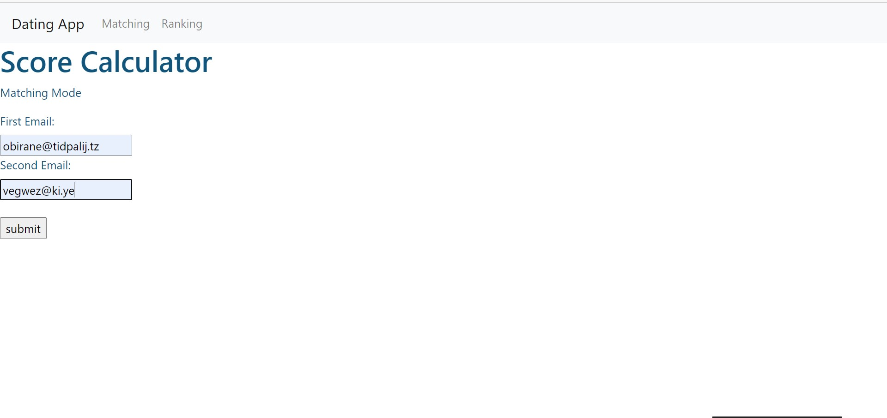
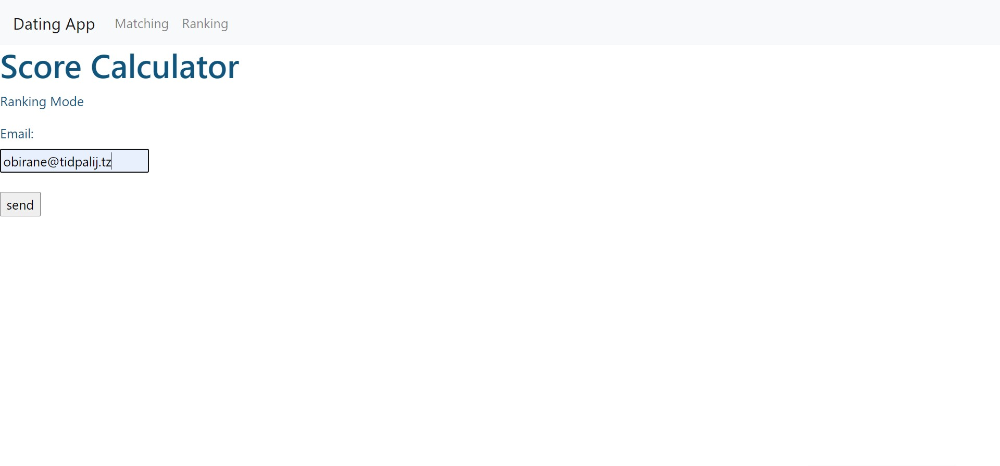
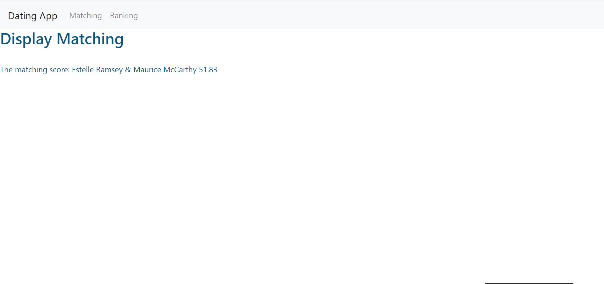
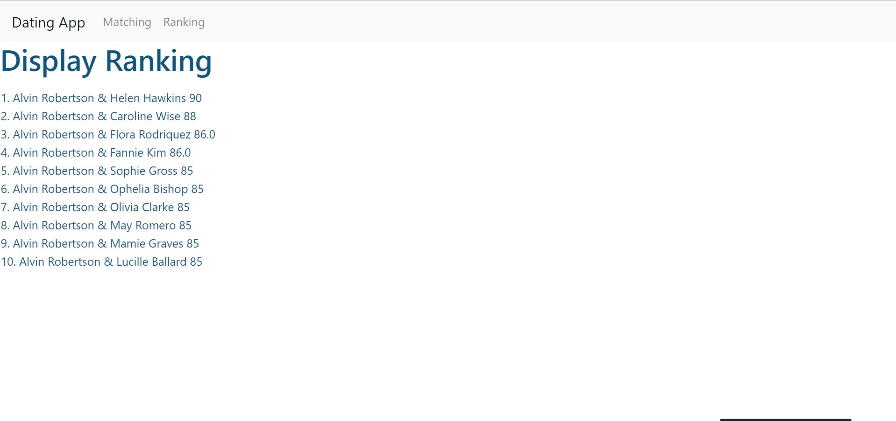

# UVEC_2020 - Dating-App
Dating App is an online dating platform application that evaluates potential matches of two users (in CSV file). It means to help users find their best pair that matches their preferences. 

The topic in this competition is to use any algorithms to create a dating app and employ frontend tools to turn it into a web API.  

Check out this link: [https://dating-app-uvec2020.herokuapp.com/](https://dating-app-uvec2020.herokuapp.com/)

## How does Cover Letter Maker works?

1. Ask users to enter their email and/or the other email
2. Take the input emails and search for all details of each in a CVS file
3. Use the details retrieved to calculate a matching score from many formulas
4. On Matching Mode: Display a matching score and owner name
5. On Ranking Mode: Calculate scores of every user and Display the top 10 highest scores and owner names  

## The division of labor
A team - Communicate to make algorithms to calculate a matching score formula
Jeet - Code the python script
Poom - Use Flask to implement the script as a web application

## Key skills      
* Python
* Flask Flamework
* Jinja
* CSV library
* GEopy library
* HTML/CSS

## What is next for the Dating app?
1. Make the score more precise (formula)
2. Improve the UI using JavaScript
3. Improve coding style
4. Make a form to add new users
5. Change storage from a CSV file to a database

## Example of inputFile, input, model, and result

### Maching Mode

 
### Rank_Mode

### Display Matching

### Display Ranking

